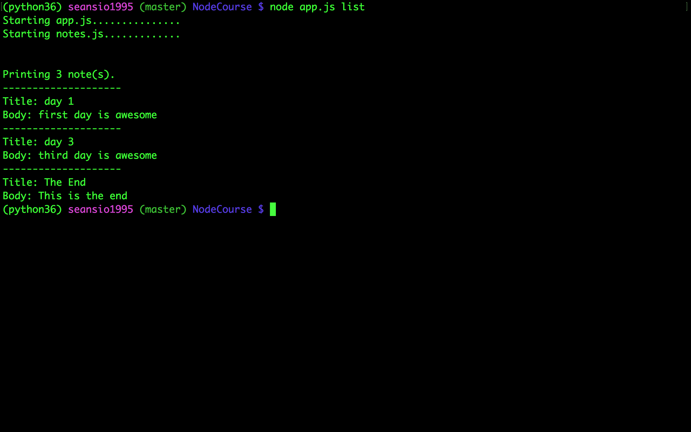
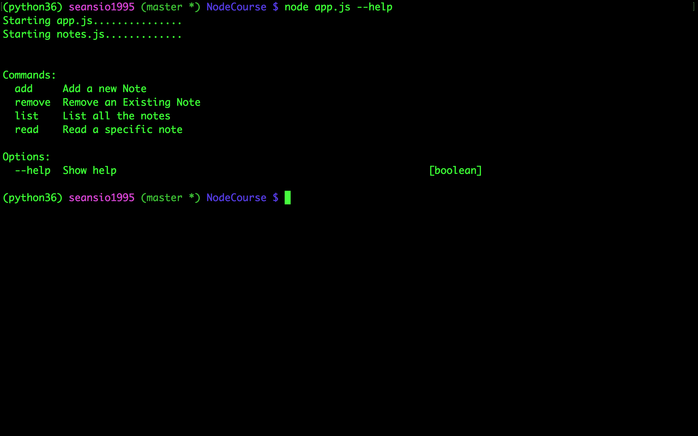
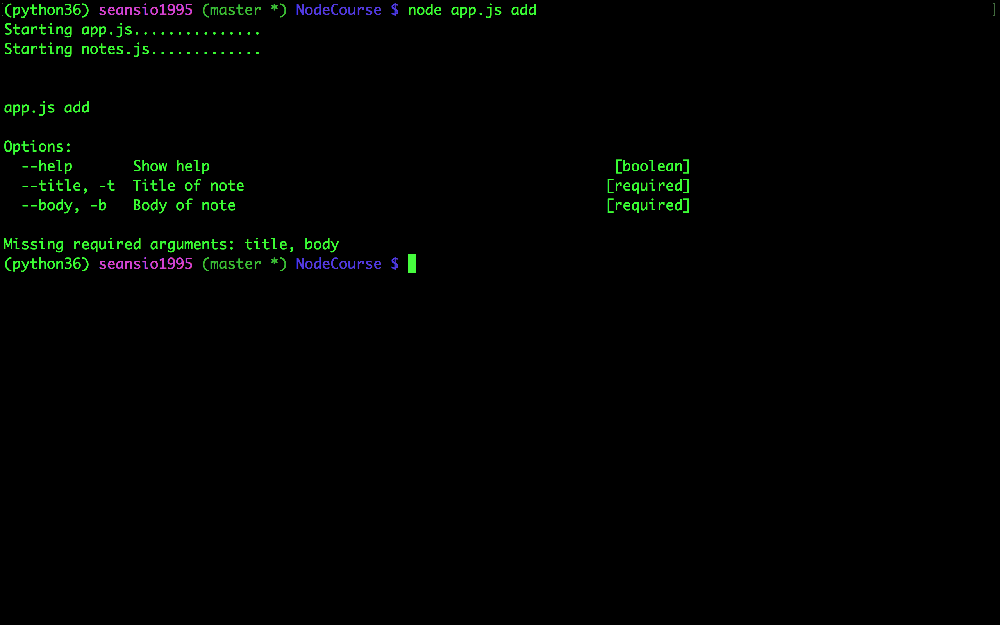

# A Simple Terminal Notebook
> Make it Simple.

[![NPM Version][npm-image]][npm-url]
[![Build Status][travis-image]][travis-url]
[![Downloads Stats][npm-downloads]][npm-url]

User can add,read,remove specific note and list all notes.



## Installation

OS X & Linux:

```sh
git clone github-project-link
```

## Usage example

To run the project is easy. Git clone the
project and run node app.js in your terminal. For example, if you want to add the note just run:

```sh
node app.js add --title="Day 1" --body=="Good day"
```

To show all the existing commands
```sh
node app.js --help
```


To know the argument options for specific command
```sh
node app.js add
```



_For more examples and usage, please refer to the [Wiki][wiki]._

## Development setup

Dependency installation is simple.Just git clone the project and follow the commands below.

```sh
npm install
```

## Release History

* 0.2.1
    * CHANGE: Update docs (module code remains unchanged)
* 0.2.0
    * CHANGE: Remove `setDefaultXYZ()`
    * ADD: Add `init()`
* 0.1.1
    * FIX: Crash when calling `baz()` (Thanks @GenerousContributorName!)
* 0.1.0
    * The first proper release
    * CHANGE: Rename `foo()` to `bar()`
* 0.0.1
    * Work in progress

## Meta

Sean Xiao – [@MyTwitter](https://twitter.com/SeanXiao4)

Distributed under the MIT license. See ``LICENSE`` for more information.

## Contributing

1. Fork it (<https://github.com/seansio1995/NoteApp>)
2. Create your feature branch (`git checkout -b feature/fooBar`)
3. Commit your changes (`git commit -am 'Add some fooBar'`)
4. Push to the branch (`git push origin feature/fooBar`)
5. Create a new Pull Request

<!-- Markdown link & img dfn's -->
[npm-image]: https://img.shields.io/npm/v/datadog-metrics.svg?style=flat-square
[npm-url]: https://npmjs.org/package/datadog-metrics
[npm-downloads]: https://img.shields.io/npm/dm/datadog-metrics.svg?style=flat-square
[travis-image]: https://img.shields.io/travis/dbader/node-datadog-metrics/master.svg?style=flat-square
[travis-url]: https://travis-ci.org/dbader/node-datadog-metrics
[wiki]: https://github.com/yourname/yourproject/wiki
